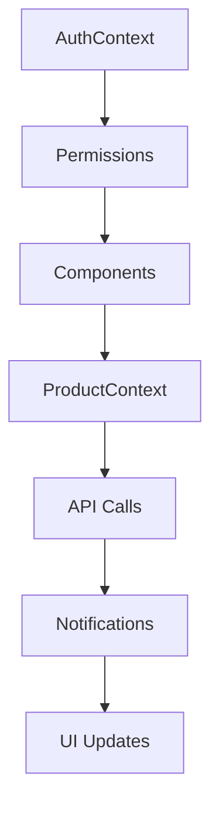

# 🏗️ Architecture Frontend Refactorisée

## 📋 Vue d'ensemble

Le frontend a été entièrement refactorisé pour utiliser une architecture moderne basée sur :
- **Contextes React** pour la gestion d'état globale
- **Hooks personnalisés** pour la logique réutilisable
- **Composants modulaires** pour une meilleure maintenabilité
- **Séparation des responsabilités** claire

## 🗂️ Structure des dossiers

```
frontend/src/
├── app/
│   └── admin/
│       └── dashboard/
│           ├── page.jsx          # Point d'entrée simplifié
│           └── Dashboard.jsx     # Composant principal
├── components/
│   ├── ui/                      # Composants UI réutilisables
│   │   ├── Button.jsx
│   │   ├── Modal.jsx
│   │   ├── Notification.jsx
│   │   └── ConfirmDialog.jsx
│   ├── forms/                   # Formulaires spécialisés
│   │   └── ProductForm.jsx
│   ├── products/                # Composants liés aux produits
│   │   └── ProductList.jsx
│   └── dashboard/               # Composants du dashboard
│       ├── DashboardHeader.jsx
│       ├── DashboardNavigation.jsx
│       ├── ProductsTab.jsx
│       ├── UsersTab.jsx
│       └── SettingsTab.jsx
├── contexts/                    # Contextes React
│   ├── AuthContext.js
│   ├── ProductContext.js
│   ├── NotificationContext.js
│   └── index.js
├── hooks/                       # Hooks personnalisés
│   ├── useForm.js
│   ├── useModal.js
│   └── index.js
└── styles/
    └── dashboard.scss
```

## 🔧 Contextes React

### AuthContext
**Responsabilité :** Gestion de l'authentification et des permissions
```javascript
const { adminInfo, loading, hasPermission, handleLogout } = useAuth()
```

**Fonctionnalités :**
- ✅ Authentification automatique
- ✅ Gestion des permissions
- ✅ Déconnexion sécurisée
- ✅ Redirection automatique

### ProductContext
**Responsabilité :** Gestion des produits (CRUD)
```javascript
const { products, loading, error, fetchProducts, createProduct, updateProduct, deleteProduct } = useProducts()
```

**Fonctionnalités :**
- ✅ Chargement des produits
- ✅ Création de produits
- ✅ Modification de produits
- ✅ Suppression de produits
- ✅ Gestion des erreurs

### NotificationContext
**Responsabilité :** Gestion des notifications utilisateur
```javascript
const { notifications, showNotification, hideNotification } = useNotification()
```

**Fonctionnalités :**
- ✅ Affichage de notifications
- ✅ Auto-suppression
- ✅ Types de notifications (success, error, warning, info)

## 🪝 Hooks Personnalisés

### useForm
**Responsabilité :** Gestion des formulaires
```javascript
const { values, errors, loading, handleChange, reset, setError } = useForm(initialValues)
```

**Fonctionnalités :**
- ✅ Gestion des valeurs
- ✅ Validation côté client
- ✅ Gestion des erreurs
- ✅ États de chargement

### useModal
**Responsabilité :** Gestion des modales
```javascript
const { isOpen, data, open, close, toggle } = useModal()
```

**Fonctionnalités :**
- ✅ Ouverture/fermeture
- ✅ Données associées
- ✅ Toggle

## 🧩 Composants Réutilisables

### Composants UI
- **Button** : Bouton avec variants et états
- **Modal** : Modale générique avec backdrop
- **Notification** : Système de notifications
- **ConfirmDialog** : Dialog de confirmation

### Composants Spécialisés
- **ProductForm** : Formulaire de produit (création/modification)
- **ProductList** : Liste des produits avec actions
- **DashboardHeader** : En-tête du dashboard
- **DashboardNavigation** : Navigation conditionnelle

## 🎯 Avantages de la Refactorisation

### ✅ Maintenabilité
- **Séparation claire** des responsabilités
- **Composants réutilisables** et modulaires
- **Code plus lisible** et organisé

### ✅ Performance
- **Contextes optimisés** avec useCallback
- **Rendu conditionnel** intelligent
- **Chargement paresseux** des composants

### ✅ Développement
- **Hooks personnalisés** pour la logique commune
- **Types de composants** standardisés
- **Gestion d'état** centralisée

### ✅ Testabilité
- **Composants isolés** faciles à tester
- **Logique métier** séparée de l'UI
- **Mocks simples** pour les contextes

## 🔄 Flux de Données



## 📝 Utilisation

### Dans un composant
```javascript
import { useAuth, useProducts, useNotification } from '@/contexts'
import { useForm, useModal } from '@/hooks'

function MyComponent() {
  const { hasPermission } = useAuth()
  const { products, createProduct } = useProducts()
  const { showNotification } = useNotification()
  const form = useForm()
  const modal = useModal()
  
  // Logique du composant...
}
```

### Ajout d'un nouveau contexte
1. Créer le fichier dans `contexts/`
2. Exporter dans `contexts/index.js`
3. Ajouter le Provider dans `Dashboard.jsx`

### Ajout d'un nouveau hook
1. Créer le fichier dans `hooks/`
2. Exporter dans `hooks/index.js`
3. Utiliser dans les composants

## 🚀 Prochaines Étapes

- [ ] Ajouter des tests unitaires
- [ ] Implémenter la gestion des utilisateurs
- [ ] Ajouter la pagination
- [ ] Optimiser les performances avec React.memo
- [ ] Ajouter TypeScript pour une meilleure sécurité des types
